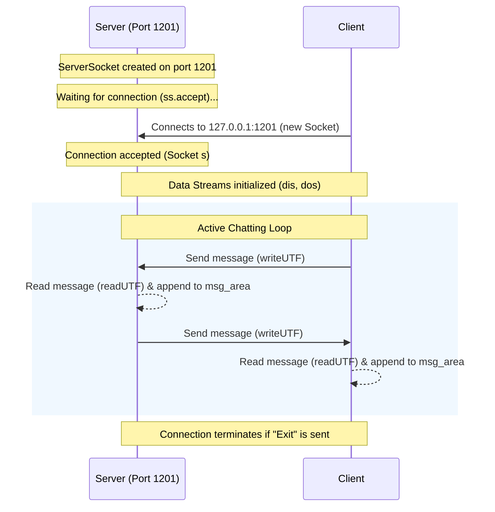

# WhatsApp-Themed Java Chat Application

A lightweight, real-time, desktop chat application built in Java using **Swing** for the Graphical User Interface (GUI) and **Sockets** for network communication. The user interface is heavily inspired by WhatsApp, featuring customized wallpapers, sender/receiver avatars, and elegant layout styles.

---

## 📸 Overview & Features

- **WhatsApp-Inspired Aesthetics**:
  - Custom chat wallpaper background (`background.png`).
  - Circular avatar icons for contacts (`avatar.png`).
  - WhatsApp green themed headers (`#008069`) and send buttons.
- **Real-Time Messaging**: Bi-directional message exchange between the Server and Client.
- **Robust TCP/IP Socket Networking**: Uses Java's `ServerSocket` and `Socket` classes to guarantee reliable message delivery over TCP port `1201`.
- **Responsive Layout**: Designed using Swing components that dynamically adapt, wrap text cleanly, and support scrolling.

---

## 🏗️ Architecture & Flow

The application operates on a classic **Client-Server model**. Below is a sequence diagram illustrating the network handshake and communication loop:



---

## 📂 Project Structure

```text
ChatApplication/
├── nbproject/                 # NetBeans project configuration files
├── src/
│   └── com/
│       └── chat/
│           ├── Client.java    # Client application source & GUI
│           ├── Client.form    # NetBeans GUI Form for Client
│           ├── Server.java    # Server application source & GUI
│           ├── Server.form    # NetBeans GUI Form for Server
│           └── resources/     # Visual UI assets
│               ├── avatar.png
│               ├── background.png
│               └── send.png
├── build.xml                  # Apache Ant build script
└── manifest.mf                # JAR Manifest file
```

---

## 🛠️ Requirements & Setup

### Prerequisites
- **Java Development Kit (JDK)**: Version 8 or higher.
- **Apache Ant** (optional, for command-line builds) or an IDE like **NetBeans**, **IntelliJ IDEA**, or **Eclipse**.

### Running the Application

To test the chat application locally on your machine, follow these steps:

#### Step 1: Run the Server
The Server must be started first so it can listen for incoming client connections on port `1201`.

**Using Command Line:**
1. Navigate to the project root directory.
2. Compile the source files:
   ```bash
   javac -d build/classes src/com/chat/*.java
   ```
3. Run the Server class:
   ```bash
   java -cp build/classes com.chat.Server
   ```

*(Alternatively, open the project in **NetBeans** and run `Server.java` directly.)*

#### Step 2: Run the Client
Once the Server window is open and waiting, start the Client to establish the socket connection.

**Using Command Line:**
1. Run the Client class in a separate terminal:
   ```bash
   java -cp build/classes com.chat.Client
   ```

*(Alternatively, in **NetBeans**, right-click `Client.java` and select **Run File**.)*

---

## 💬 How to Use

1. Once both applications are running, you will see the **WhatsApp Server** and **WhatsApp Client** windows.
2. Type a message in the text input field at the bottom of either window.
3. Click the **Send** button or press Enter to transmit your message.
4. The message will instantly appear in the chat log area of the opposing window.
5. To close the session, type `Exit` and send it, or simply close the windows.

---

## 🎨 Customizing the Theme

You can easily customize the visual appearance of the chat windows by replacing the assets in the `src/com/chat/resources/` directory:
- **`background.png`**: Change this image to update the chat wallpaper.
- **`avatar.png`**: Update this icon to change the profile picture displayed in the chat header.
- **`send.png`**: Modify this icon to customize the send button style.

---

> [!NOTE]
> This project was developed as part of a Java Internship project focusing on Socket Programming, GUI development in Java Swing, and event-driven application design.
